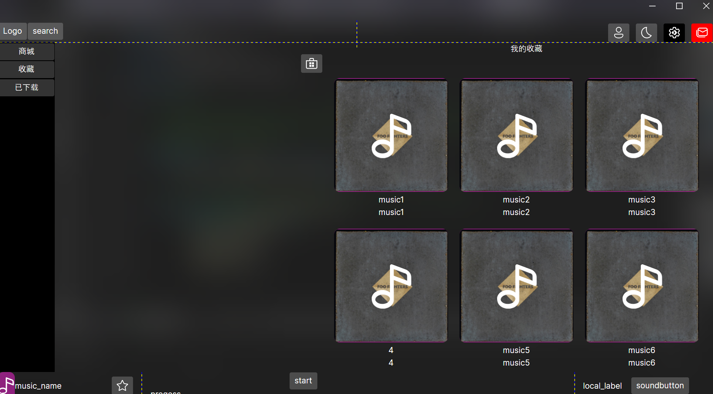

# MiniMusicDesktop

这是一个简单的音乐管理器的纯前端桌面应用程序，使用 **.NET** 旗下的 **Avalonia** 跨平台UI进行开发,其中使用的MVVM模式为ReavtiveUI。该程序提供了面向桌面的GUI图形界面（既包括web前端如VUE3或桌面前端如**Avalonia**编写的桌面前端），该程序可以和另一个仓库中的后端程序搭配使用。

与音乐管理器配套的MusicManagementsMinimalAPI后端程序同样可从本人的其他仓库中得到。



---

### 所需依赖

前端程序所需依赖

运行环境为 **.NET**旗下的 **Avalonia** ,其次还安装了解包所需的序列化器包，均可使用NuGet进行安装，其中 **Avalonia**涉及的包很多。

```
Avalonia  11.0.2
Avalonia.Desktop  11.0.2
Avalonia.Diagnostics  11.0.2
Avalonia.Fonts.Inter  11.0.2
Avalonia.ReactiveUI  11.0.2
Avalonia.Themes.Fluent  11.0.2
iTunesSearch  1.0.44
Newtonsoft.Json  13.0.3
```


### 运行

1 clone本人仓库的另一个MusicManagementsMinimalAPI后端程序配置后并运行。

2 在Visual Studio中运行MiniMusicDesktop前端项目。


---

### 项目目录

项目目录所涉及的主要文件夹和文件结构

MiniMusicDesktop


|——Assert    *资源文件夹*

|——Models    *数据模型类文件夹*

|——ViewModels    *视图模型文件夹*

|——Views    *视图文件夹*

|——App.axaml    

|——Icons.axaml    *图标资源*

|——ViewLocator.cs    *视图定位器*

|——Program.cs    *主程序*
